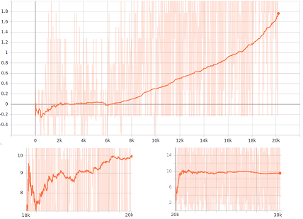

# Reinforced learning on マリオカート using Batched-IMPALA

This project is an implementation of IMPALA with PyTorch. It also incorporates a configuration to test the algorithm on MarioKart Snes.

## Results 

I trained an AI to play to Mario Kart on my personnal computer. However, due to its **poor configuration** (8gb ram, NVidia 1060...), I could only run **2 agents**, for **12 hours** (divided in three phases). Maibe nicer results will come out one I get my hands on something a bit more powerful...
Yet! The results are pretty convicing. The AI was trained on three different levels (MarioCircuit.Act1~3) and tested on MarioCircuit.Act4 (unseen).

Rewards obtained :   
   

Result on MarioCircuit.Act3 (**SEEN**)   
   

Result on MarioCircuit.Act4 (**UNSEEN**)   
   


## Presentation

The main features of this project are :
* **Asynchronous Actor-Critic**
  * As was proposed in *Reinforcement Learning through Asynchronous Advantage Actor-Critic on a GPU* ([arXiv:1611.06256](https://arxiv.org/abs/1611.06256)) ;
  * This method takes advantage of the GPU's parallelisation to improve the results of A3C. Namely, all the computation are made in a batched way using a predictor thread and a learner thread. This is however only for the **single GPU case**. But it could be extended to the mutli-GPU case with only few additions.
* **IMPALA**
  * This framework was proposed in *IMPALA: Scalable Distributed Deep-RL with Importance Weighted Actor-Learner Architectures* ([arXiv:1802.01561](https://arxiv.org/abs/1802.01561)) ;
  * *V-Trace* (a novel actor-critic algorithm), was also introduced in this paper. When using asynchronous updates based on trajectories recorded by agents. It provides an off-policy correction which reduces the bias and the variance, while achieving significan throughput.
* **PyTorch and Tensorboard**
  * The implementation I proposed is based on the popular framework [PyTorch](https://pytorch.org/), develloped byFacebook. I used **Torchscripts** to improve the overall training speed, with significant imporvements
  * A process is dedicated to visualisation thanks to tensorboard, and intergrates various metrics (duration, cumulated reward, loss, batches rates, etc...);
* And among the rest...
  * **Gym Wrappers** for the [retro](https://github.com/openai/retro) environnement of OpenAI ;
  * **Ram Locations** of the main variables when emulating Mario Kart (using [Bizhawk](https://github.com/TASVideos/BizHawk)) ;


## Running the code

### Installation

To run this project, you need to install **nvidia-docker**. Just follow the installation steps on the [official repository from nvidia](https://github.com/NVIDIA/nvidia-docker). You can also run the code directly on CPU, but I wouldn't recommand it, since it's coded in a GPU perspective.

### Building the docker image

The project can be runned into a Docker Container. It takes care of installing the dependencies, and linking the Snes configuration of Mario Kart.

```bash
# Docker build the image
docker build -t KartRL:latest . 

# Docker run the container
# You can also use volume to work on the code inside a container [-v [folder]:/App]
docker run -it --rm -p 6006:6006 KartRL:latest
```

### Running the code

```bash
# Running the code
python run.py

# Outputing the result (replace state and checkpoint if necessary)
python record.py -s MarioCircuit.Act3 -p checkpoint.pt

# Launch the tensorboard
tensorboard --bind_all --port 6006 --logdir=/logs
```

**Enjoy!** If you have any nice results, don't hesitate to message me!

## Possible improvements

- [ ] Replay Memory
- [ ] Fix Callback process
- [ ] Automatic tunning
- [ ] Multi-GPU case
- [ ] Comparaison with other algos
- [ ] Tuning of the parameters


## References :

* Courses  
  * [Reinforcement learning by David Silver (UCL)](http://www0.cs.ucl.ac.uk/staff/d.silver/web/Teaching.html)
* Papers
  * Playing Atari with Deep Reinforcement Learning [arXiv:1312.5602](https://arxiv.org/abs/1312.5602)
  * Asynchronous Methods for Deep Reinforcement Learning [arXiv:1602.01783](https://arxiv.org/abs/1602.01783)
  * Reinforcement Learning through Asynchronous Advantage Actor-Critic on a GPU[arXiv:1611.06256](https://arxiv.org/abs/1611.06256)
  * IMPALA: Scalable Distributed Deep-RL with Importance Weighted Actor-Learner Architectures [arXiv:1802.01561](https://arxiv.org/abs/1802.01561)
  * Great source for RL papers by OpenAI: [Spinning-up OpenAI](https://spinningup.openai.com/en/latest/spinningup/keypapers.html)
* Others 
  * [Bizhawk](https://github.com/TASVideos/BizHawk) : SNES emulator with ram watch
  * [Maps](http://www.mariouniverse.com/maps-snes-smk/), [RAM map](https://datacrystal.romhacking.net/wiki/Super_Mario_Kart:RAM_map)